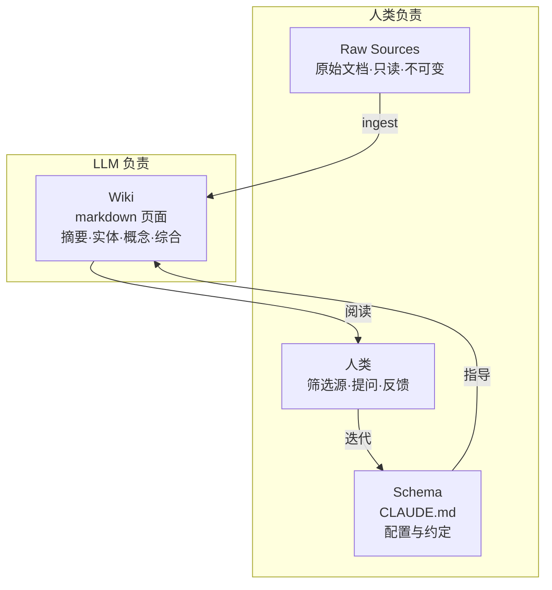

LLM Wiki 是由 [[entities/Andrej Karpathy|Andrej Karpathy]] 提出的一种个人知识管理模式：利用 LLM **增量编译并维护一个持久化的、结构化的 markdown 知识库**，替代传统的「查询时检索原始文档」的 RAG 范式。

## 核心差异：编译 vs 检索

| 维度 | RAG（传统） | LLM Wiki |
|------|------------|----------|
| 知识形态 | 原始文档碎片 | 结构化、交叉引用的 wiki 页面 |
| 查询方式 | 每次从零检索、拼接 | 直接读取已编译的 wiki 页面 |
| 知识积累 | 无积累，重复劳动 | 复利增长，越用越丰富 |
| 矛盾处理 | 每次重新发现 | 已标注，持续跟踪 |
| 维护责任 | 人类（易放弃） | LLM（不知疲倦） |

## 三层架构

1. **Raw Sources**：人类筛选的原始文档（文章、论文、笔记），LLM 只读不写
2. **Wiki**：LLM 全权负责写和维护——摘要页、实体页、概念页、比较分析、综合结论
3. **Schema**：配置文档（如 `CLAUDE.md`），定义目录结构、命名约定、操作流程，人类与 LLM 共同演化

## 三大操作

### Ingest（摄入）

添加新源 → LLM 读取 → 提取要点 → 写摘要页 → 更新相关实体/概念页 → 更新索引 → 记录日志。单个源通常触及 **10–15 个 wiki 页面**。

### Query（查询）

对 wiki 提问 → LLM 读取索引定位相关页面 → 深入阅读 → 综合回答并标注引用（`[[Page Name]]`）。关键洞察：**优质回答可回写为 wiki 新页面**，使探索本身也产生复利。

### Lint（整理）

定期健康检查：

- 页面间矛盾
- 被新源推翻的过时声明
- 孤儿页（无入站链接）
- 重要概念缺少独立页面
- 缺失交叉引用
- 可通过网络搜索填补的数据缺口

## 关键文件

- **index.md**：内容导向的总目录，按分类列出所有页面，每次 ingest 后更新
- **log/YYYYMMDD.md**：时间线记录，append-only，追踪 wiki 演变历程

## 工具生态

- **Obsidian**：本地 markdown 编辑器，Graph View 展示页面关联，是浏览 wiki 的 IDE
- **Obsidian Web Clipper**：快速将网页转为 markdown 存入 raw/
- **qmd**：本地混合搜索（BM25 + 向量 + LLM 重排），在 wiki 规模超过数百页时替代纯索引查询
- **Marp**：基于 markdown 的幻灯片格式，可从 wiki 内容直接生成演示
- **Dataview**：Obsidian 插件，基于 frontmatter 运行动态查询

## 为什么有效

维护知识库的枯燥工作（更新交叉引用、保持摘要时效、标注矛盾、维护一致性）正是 LLM 擅长而人类易放弃的工作。人类的角色：**策展源、引导分析、提出好问题、思考意义**。LLM 的角色：**其他一切**。

## 思想渊源

与 [[entities/Vannevar Bush|Vannevar Bush]] 1945 年提出的 **Memex** 精神相通——私人的、主动策展的、以文档间关联为核心的知识库。Bush 未解决的是「谁来维护」，LLM 补上了这一环。
