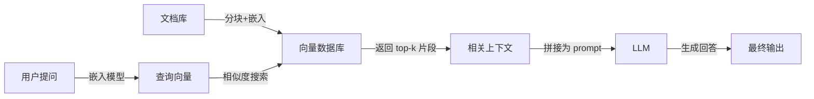

RAG（Retrieval-Augmented Generation，检索增强生成）是一种将外部知识检索与大语言模型生成结合的技术架构。当用户提问时，系统先从文档库中检索相关片段，再将这些片段作为上下文提供给 LLM，由其生成回答。

## 标准工作流程

1. **Indexing**：文档被切分为 chunks，通过嵌入模型转为向量，存入向量数据库
2. **Retrieval**：用户查询同样转为向量，在数据库中搜索最相似的 chunks
3. **Generation**：将检索到的 chunks 与查询一起送入 LLM，生成带引用来源的回答

## 优势

- **知识时效性**：无需重新训练模型即可更新知识库
- **可溯源**：回答可标注来源文档，增强可信度
- **私有化**：敏感文档无需上传至第三方模型服务商
- **成本效益**：比微调（fine-tuning）更轻量，适合频繁更新的知识

## 局限性

- **无知识积累**：每次查询都从零检索、拼接，复杂问题需要 LLM 反复发现同一关联
- **上下文窗口限制**：检索到的 chunks 总量受限于模型上下文长度
- **分块边界问题**：关键信息可能恰好被切分在两块边界，导致检索遗漏
- **检索质量依赖**：嵌入模型的语义理解能力和向量数据库的召回率直接影响最终效果

## 与 LLM Wiki 的对比

| 维度 | RAG | LLM Wiki |
|------|-----|----------|
| 知识形态 | 原始文档碎片 | 结构化、交叉引用的编译页面 |
| 查询成本 | 每次需检索+重排+生成 | 直接读取已编译页面 |
| 知识复利 | 无 | 有，ingest 和 query 都丰富 wiki |
| 矛盾处理 | 每次重新发现 | 已标注并持续跟踪 |
| 适合场景 | 大规模文档库、快速问答 | 深度研究、长期积累、个人知识管理 |

RAG 和 LLM Wiki 并非互斥。大型 wiki 在超过数百页后，可引入向量搜索（如 qmd）辅助 LLM 定位相关页面，形成「编译层 + 检索层」的混合架构。
