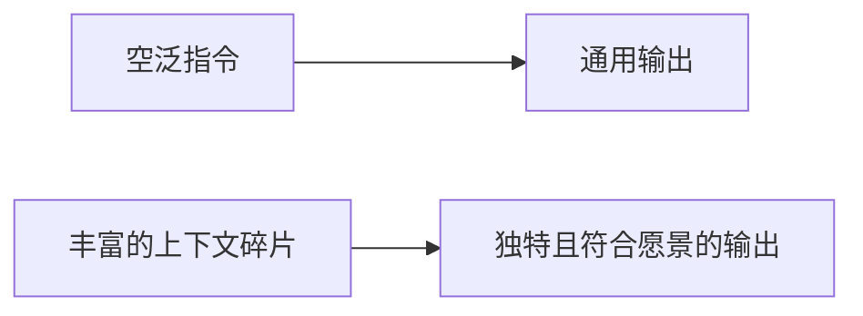

提示工程（Prompt Engineering）是指通过精心设计的自然语言输入，引导大型语言模型（LLM）产生高质量、符合预期的输出的技术。

## 核心定义：自然语言编程

[[entities/Tech With Tim]] 提出，**提示工程本质上是用自然语言编程**。与 Python、JavaScript 不同，你用的是日常语言来指导模型完成任务。同一个模型在不同提示下可以表现得「聪明」或「无用」——差异不在模型，而在提示的清晰度、上下文和结构。

模型没有内置任务清单，你必须在提示中定义：任务、角色、格式和约束。

## 核心洞察：世界构建

[[entities/Varun Mayya]] 从另一个角度提出，**提示工程的本质是世界构建（world building）**。

当你只给 AI 一个空泛指令（如「给我一个创意」），它会退回到最通用的、训练数据中最常见的答案。但如果你提供足够的「拼图碎片」——上下文、约束、参考、例子——AI 就能填充出一个独特且符合你愿景的世界。

## LLM 的工作机制

### 文本预测本质
- LLM 核心是**文本预测模型**（text prediction model）
- 给定输入 tokens，预测下一个最可能出现的 tokens
- 推理模型的「思考」其实是后台 orchestration 自动注入 chain-of-thought 指令

### 上下文注入
- **模型本身没有记忆**
- ChatGPT、Claude 等工具在后台自动注入：对话历史、系统提示、工具描述等
- 99% 的情况下，你写的 prompt 不是模型看到的全部内容

## Steering vs Commanding

[[entities/Tech With Tim]] 区分了两种交互模式：

| 方式 | 示例 | 结果 |
|------|------|------|
| **Commanding** | "Summarize this" | 模型自行选择长度、风格、焦点 |
| **Steering** | "You are an executive assistant. Summarize in 4 bullet points, focus on decisions and action items. No filler." | 精确控制输出方向 |

Steering 的核心要素：**长度、焦点、格式、约束条件**

## 基础技巧

### 1. 四要素框架（Set the Scene）
包含以下四个要素的提示几乎总能获得更好的结果：

- **Role**（角色）："You are a senior B2B copywriter"
- **Audience**（受众）："The audience is ops managers at mid-sized companies"
- **Tone**（语气）："Confident but not salesy"
- **Format**（格式）："Two sentence LinkedIn ad, end with a clear CTA"

### 2. Few-Shot Prompting
提供输入-输出对示例，让模型推断模式。特别适用于：
- 分类任务
- 特定格式输出
- Edge cases 处理

与 fine-tuning 的本质相同：通过示例让模型学习特定模式。

### 3. Chain of Thought
要求模型在给出最终答案前**逐步推理**，减少逻辑、数学、规划类任务的错误。

> 现代推理模型（如 o1/o3、Claude 3.7 Sonnet thinking）已内置此机制，但在 API 调用或非推理模型中仍需要显式要求。

### 4. Structured Output
要求模型以 JSON、XML、Markdown 表格等结构化格式输出。提供精确的 schema 示例，便于下游解析和使用。

### 5. Constraints & Negatives
**有时最有效的提示是告诉模型「不要做什么」**：
- 长度："Keep under 150 words"
- 语气："No slang or humor. Do not apologize."
- 格式："Do not use bullet points."
- 内容："Do not suggest paid tools."

### 6. Iterative Refinement
第一个 prompt 很少给出完美结果。将提示视为**对话而非一次性尝试**：
初稿 → "Shorter" → "More formal" → "Add another example" → "Focus only on X"

### 7. Interview Style Prompting
**让模型 Interview 你**，而非你猜测模型需要什么上下文：
1. 陈述目标
2. 模型提出澄清问题
3. 你逐一回答
4. 模型基于完整上下文执行

价值：人类往往会遗漏细节、做出假设，而模型知道它自己需要什么信息。

## 高级技巧

### System vs User Prompts
- **System Prompt**：设定模型身份、规则、风格，通常对用户不可见，持久生效
- **User Prompt**：单次任务指令
- 应用：ChatGPT Custom Instructions、Cursor agent 配置、API system message

### Prompt Chaining
将复杂任务拆分为多个步骤，用前一步的输出作为下一步的输入。优势：每一步可验证结果质量。

示例：生成大纲 → 基于大纲扩写 → 生成 SEO meta 信息

### Self Evaluation
让模型对自己的输出进行 critique 或评分。

**关键技巧**：在**新会话**中评估，并谎称 "I wrote this"（而非 "AI wrote this"），以获得更客观的反馈。

### Temperature & Parameters
- **低 temperature（~0-0.3）**：更可重复，适合事实、代码、分类
- **高 temperature（~0.7-1.0）**：更创意，适合头脑风暴、文案变体

## 进阶技巧（Varun Mayya）

### 元提示（Meta Prompting）
用 AI 生成给另一个 AI 的提示。例如先向 GPT 描述你的世界，再让它生成适合 diffusion model 的 prompt。

### 角色分层（Personas）
用不同角色解释同一概念，在认知深度间快速跳跃：
- 给 5 岁小孩
- 给 10 岁有基础的人
- 给领域专家

### 置信度校准
要求 AI 为每个回答附带**置信度分数**，减少幻觉。

### 情感提示
AI 对情感语言有反应：
- "take a deep breath" → 提升数学表现
- "think harder" → thinking models 消耗更多 token，输出更深思熟虑
- 威胁/压力式语言 → 提升数值准确性

原理：LLM 的训练数据包含人类写作中情感与认知的关联痕迹。

## 提示工程 vs 自定义命令

[[summaries/obsidian-claude-codebook|Vin 的自定义 slash 命令]]和单次提示技巧代表两种不同层次：

| 层次 | 代表 | 重点 |
|------|------|------|
| 单次提示 | Varun Mayya, Tech With Tim | 单次交互中的上下文质量与输出格式 |
| 系统化命令 | Vin | 将重复性认知任务封装为可复用的工作流 |

两者共享同一核心原则：**上下文质量决定输出质量**。

## 常见误区

| 错误 | 症状 | 修复 |
|------|------|------|
| 懒惰提示 | 通用或不相关输出 | 添加 role, audience, tone, format |
| 一次塞入太多任务 | 遗漏、混淆 | 拆分为步骤（chaining） |
| 缺少上下文/示例 | 格式或风格错误 | 添加 few-shot 示例 |
| 模型忽略格式 | 难以解析 | 显式请求特定结构 + "only output..." |
| 假设模型有记忆 | 遗忘之前的上下文 | 重复关键事实；新会话不假设记忆 |
| 不消除 AI 痕迹 | 内容显得 generic | 避免 "X is more than just Y" 句式 |
| 不验证输出 | 幻觉数字/事实 | 追问置信度；要求引用来源 |
