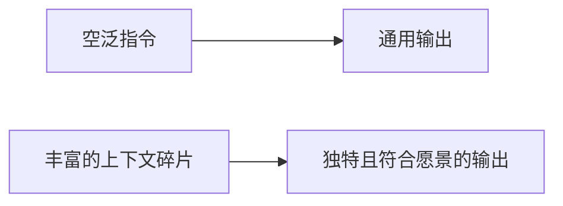

提示工程（Prompt Engineering）是指通过精心设计的自然语言输入，引导大型语言模型（LLM）产生高质量、符合预期的输出的技术。

## 核心洞察：世界构建

[[entities/Varun Mayya]] 提出，**提示工程的本质是世界构建（world building）**。

当你只给 AI 一个空泛指令（如「给我一个创意」），它会退回到最通用的、训练数据中最常见的答案。但如果你提供足够的「拼图碎片」——上下文、约束、参考、例子——AI 就能填充出一个独特且符合你愿景的世界。

这就是为什么 99% 的 AI 输出看起来一样：人们没有投入精力提供拼图碎片。

## 关键技巧

### 1. 示例驱动（Example Giving）
系统提示（system prompt）的核心其实是 if-else 式的条件示例：「如果用户问这个，拒绝；如果用户问那个，礼貌拒绝。」给出正面和反面的例子比抽象描述更有效。

### 2. 元提示（Meta Prompting）
用 AI 生成给另一个 AI 的提示。例如先向 GPT 描述需求，再让它生成适合 diffusion model 的 prompt。GPT 知道哪些元素 diffusion model 会「过度烘焙」，从而帮你过滤。

### 3. 角色分层（Personas）
用不同角色解释同一概念，可以在认知深度间快速跳跃：
- 给 5 岁小孩
- 给 10 岁有基础的人
- 给领域专家

### 4. 置信度校准
要求 AI 为每个回答附带**置信度分数**，可以有效减少幻觉。AI 倾向于表现得比实际更有信心，显式要求分数能暴露这种偏差。

### 5. 情感提示
AI 对情感语言有反应：
- "take a deep breath" → 提升数学表现
- "think harder" → thinking models 消耗更多 token，输出更深思熟虑
- 威胁/压力式语言 → 提升数值准确性

原理：LLM 的训练数据包含人类写作中情感与认知的关联痕迹。

## 提示工程 vs 自定义命令

[[summaries/obsidian-claude-codebook|Vin 的自定义 slash 命令]]和 Varun 的单次提示技巧代表两种不同层次的提示工程：

| 层次    | 代表          | 重点                 |
| ----- | ----------- | ------------------ |
| 单次提示  | Varun Mayya | 单次交互中的上下文质量与输出格式   |
| 系统化命令 | Vin         | 将重复性认知任务封装为可复用的工作流 |

两者共享同一核心原则：**上下文质量决定输出质量**。

## 常见误区

1. **懒惰提示（lazy prompting）**：只给一句话指令，期待 AI 猜到你的意图
2. **不消除 AI 痕迹**：接受 generic 的 AI 句式（"X is more than just Y"）
3. **不验证输出**：尤其是数字和事实，不追问置信度
4. **忽视关系数据**：只搜索文本内容，不利用 backlinks、tags 等结构性信息
