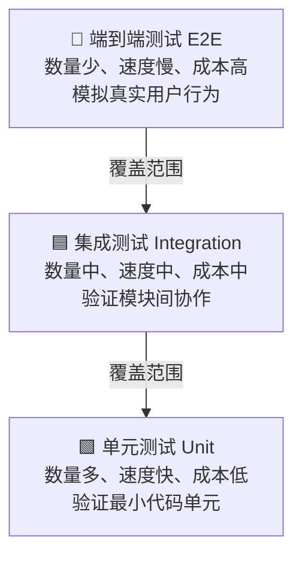

测试金字塔（Testing Pyramid）由 Mike Cohn 推广，是指导测试策略分配的经典模型。它以金字塔的三层结构说明：越靠近底层的测试应该越多，越靠近顶层的测试应该越少。

## 三层详解

### 单元测试（Unit Tests）

- **目标**：测试最小代码单元（函数、方法、类）在完全隔离环境下的正确性
- **速度**：毫秒级，可每秒运行数千个
- **精确度**：失败时可直接定位到具体函数
- **示例**：调用 `calculateTotal(items)` 并断言返回值为预期总价

### 集成测试（Integration Tests）

- **目标**：验证不同组件协作时的行为，如 API 与数据库的读写、前端与后端的通信、支付系统与第三方网关的对接
- **速度**：秒级
- **价值**：发现单元测试无法覆盖的交互类 bug

### 端到端测试（End-to-End Tests）

- **目标**：从用户视角验证完整系统链路，模拟点击、填写、导航等真实操作
- **速度**：分钟级
- **代价**：最慢、最脆弱、维护成本最高
- **详见**：[[concepts/端到端测试]]

## 为什么是金字塔而非倒金字塔

| 维度 | 单元测试 | 集成测试 | 端到端测试 |
|------|----------|----------|------------|
| 执行速度 | ⚡ 极快 | 🐢 中等 | 🐌 慢 |
| 维护成本 | 💰 低 | 💰💰 中 | 💰💰💰 高 |
| 脆弱程度 | 🪨 稳定 | 🍂 中等 | 💔 易碎 |
| 定位精度 | 🎯 精确 | 🔍 较精确 | 🌫️ 模糊 |
| 业务信心 | ✅ 代码正确 | ✅✅ 协作正确 | ✅✅✅ 系统正确 |

健康的测试 suite 应该在底层用大量快速的单元测试确保基础正确，用适量的集成测试验证接口契约，仅在顶层保留少量关键的端到端测试验证核心用户旅程。

## 反模式

- **冰淇淋锥（Ice Cream Cone）**：E2E 测试过多，单元测试过少，导致测试 suite 缓慢且不稳定
- **沙漏（Hourglass）**：单元测试和 E2E 都很多，但缺乏集成测试，导致两层之间断层
