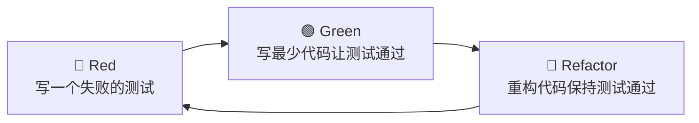

测试驱动开发（Test-Driven Development，TDD）是一种软件开发方法论，核心思想是**先写测试，再写实现**，通过短周期的反馈循环驱动设计。

## Red-Green-Refactor 循环

1. **Red**：编写一个测试，描述你期望的行为。此时测试必然失败，因为功能尚未实现。
2. **Green**：编写最少量的生产代码，使刚刚的测试通过。允许代码丑陋，目标是快速通过。
3. **Refactor**：在测试保护下重构代码，消除重复、改善命名、优化结构。测试保持绿色（通过）。

## 优势

- **设计反馈**：先写测试迫使开发者思考接口设计，产出更易用的 API
- **安全网**：每轮迭代都有测试保护，重构时更有信心
- **需求澄清**：测试即可执行的需求文档，减少理解偏差
- **聚焦**：每次只关注一个失败测试，避免过度工程

## 局限性与争议

- **学习曲线**：需要同时掌握业务逻辑、测试框架和设计原则
- **不适合探索性开发**：在需求高度不确定的初期，频繁改写测试本身会造成浪费
- **UI/E2E 测试中的 TDD**：端到端测试编写成本高、执行慢，严格遵循 TDD 的短周期反馈较困难
- **「测试仪式」风险**：为了 TDD 而 TDD，写出大量无价值的测试，反而拖慢进度

## 何时使用

- 需求相对明确的业务逻辑层（如计算、校验、状态机）
- 需要长期维护、频繁重构的核心模块
- 团队已具备测试文化和技能积累

## 何时不必强求

- 快速原型验证阶段
- 纯粹的前端 UI 布局调整
- 一次性脚本或短期工具
