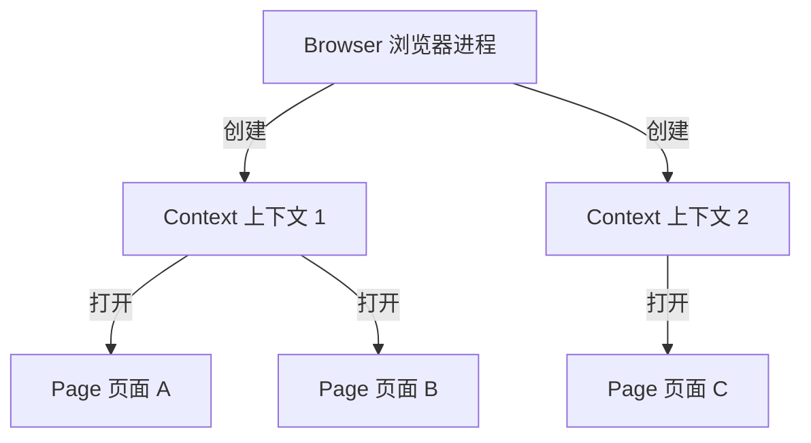

浏览器自动化（Browser Automation）指通过程序控制浏览器执行人类操作（点击、填写、导航、截图等），无需人工介入即可完成重复性网页交互任务。

## 典型应用场景

- **端到端测试**：模拟真实用户路径验证整个系统流程
- **网页截图与 PDF 生成**：将动态页面渲染为静态文件
- **数据抓取**：获取依赖 JavaScript 渲染的页面内容
- **性能监控**：定期测量页面加载与交互性能
- **表单自动填报**：批量处理重复性网页操作

## 核心技术要素

### 浏览器控制协议

现代浏览器自动化工具通常通过以下协议与浏览器通信：

- **DevTools Protocol（CDP）**：Chromium 原生调试协议，[[entities/Puppeteer|Puppeteer]] 与 [[entities/Playwright|Playwright]]（Chromium 模式）均基于此
- **WebDriver（W3C 标准）**：Selenium 使用的跨浏览器标准协议
- **自定义协议**：Playwright 针对 Firefox 和 WebKit 实现了专门的通信层，以实现更精细的控制

### 三层架构模型

主流工具（如 Playwright）采用 **Browser → Context → Page** 的层级结构：

- **Browser**：单个浏览器进程实例，资源开销较大；
- **Context**：轻量级隔离会话，Cookie、缓存、权限彼此独立，适合并行测试；
- **Page**：单个标签页，执行具体的导航与 DOM 操作。

## 主要工具对比

| 工具 | 开发方 | 支持引擎 | 核心优势 |
|------|--------|----------|----------|
| [[entities/Playwright\|Playwright]] | Microsoft | Chromium、Firefox、WebKit | 自动等待、多语言、trace 调试、Codegen |
| [[entities/Puppeteer\|Puppeteer]] | Google | Chromium | 轻量、与 Chrome 生态深度集成 |
| Selenium | 社区 / W3C | 几乎所有浏览器 | 历史最久、生态最广、多语言绑定 |
| Cypress | Cypress.io | Chromium、Firefox、WebKit | 实时重载、调试体验好、专注前端测试 |

## 高级实践

### 网络请求拦截（Mocking）

现代浏览器自动化工具支持拦截和修改网络请求，用于控制测试环境：

- **模拟错误**：返回 500 错误测试降级 UI
- **模拟慢网络**：添加延迟验证加载状态与超时处理
- **模拟特定数据**：将商品库存设为 0 测试缺货场景，无需修改数据库
- **选择性拦截**：仅拦截 POST 请求而放行 GET，精确定位故障点

[[entities/Playwright|Playwright]] 通过 `page.route()` 实现这一能力。

### 边缘 Case 测试

浏览器自动化不仅测试「正常路径」，还应覆盖：

- 空输入、超长输入、特殊字符
- 快速重复点击（防重复提交）
- XSS 注入尝试（在搜索框输入 `<script>` 验证是否被转义）
- 非法状态操作（未登录访问需授权页面、空购物车点击结算）

### Page Object Pattern

将页面结构与测试逻辑解耦：每个页面对应一个类，封装元素定位器和操作方法。UI 改版时只需修改页面对象，无需逐行调整测试用例。

### CI/CD 集成

浏览器自动化测试在持续集成中的典型配置：

- 容器化运行（Playwright 提供官方 Docker image）
- 失败时自动上传截图、录屏、trace 文件
- 并行分片（sharding）缩短总执行时间
- 定时触发（如每日）监控线上环境健康度

## headless 与 headed 模式

- **Headless**：浏览器在后台运行，无可见窗口，适合 CI/CD 流水线，资源占用更低
- **Headed**：显示真实浏览器窗口，便于本地调试与观察执行过程

现代工具（如 Playwright）通常默认 headless，但可通过配置一键切换。
