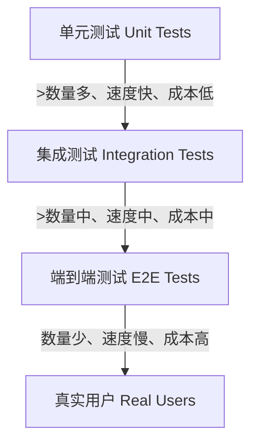

端到端测试（End-to-End Testing，简称 E2E Testing）是一种软件测试方法，模拟真实用户的完整操作流程，从前端界面到后端服务再到数据库，验证整个系统链路是否按预期工作。

## 测试金字塔中的位置

- **单元测试**：验证最小代码单元（函数、组件），运行最快
- **集成测试**：验证模块间接口协作
- **端到端测试**：验证完整用户旅程，最接近真实场景，但维护成本最高

## 为什么需要 E2E 测试

- **用户视角**：从界面出发，能发现单元测试和集成测试遗漏的跨层问题
- **回归保护**：核心流程（登录、下单、支付）一旦断裂，业务直接受损
- **部署信心**：在发布前验证关键路径，降低生产事故风险

## 主要挑战

- **flaky test（不稳定测试）**：网络延迟、异步加载、动画等导致测试间歇性失败
- **维护成本高**：UI 频繁变动时，选择器容易失效
- **执行速度慢**：需要启动真实浏览器，串行执行时反馈周期长
- **调试困难**：失败原因可能涉及前端、后端、数据库、第三方服务任意一环

## 现代 E2E 工具的趋势

以 [[entities/Playwright|Playwright]] 为代表的现代工具通过以下设计缓解上述痛点：

- **自动等待**：内置智能等待，而非固定 `sleep`，减少 flaky
- **Trace Viewer**：录制完整的操作、网络、控制台日志，失败时可逐帧回放
- **Codegen**：通过手动操作自动生成脚本，降低编写成本
- **并行隔离**：基于 Browser Context 的轻量级隔离，支持高并发执行
- **选择器弹性**：支持文本、角色、层级等多重定位策略，降低 UI 变动的影响

## 与浏览器自动化的关系

端到端测试是 [[concepts/浏览器自动化|浏览器自动化]] 的最主要应用场景之一。两者共享底层技术（浏览器控制、DOM 操作、网络拦截），但 E2E 测试更强调**可重复性、断言体系、报告输出**，而浏览器自动化本身是一个更广泛的概念，还涵盖爬虫、截图、RPA 等方向。
