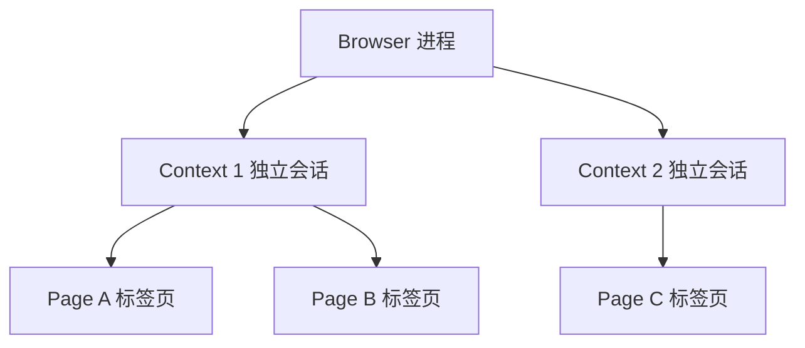

Playwright 是由 [[entities/Microsoft|Microsoft]] 开发并维护的开源浏览器自动化框架，支持 [[concepts/端到端测试|端到端测试（E2E Testing）]]与 [[concepts/浏览器自动化|浏览器自动化]]任务。

## 核心特点

- **多浏览器引擎**：Chromium（Chrome/Edge）、Firefox、WebKit（Safari）
- **多语言绑定**：TypeScript/JavaScript、Python、C#、Java
- **自动等待（Auto-waiting）**：内置智能等待机制，减少 flaky test
- **代码生成器（Codegen）**：`playwright codegen` 通过可视化操作实时生成脚本
- **录制与追踪**：内置截图、录屏、trace viewer，便于调试失败用例
- **网络层控制**：拦截、修改、模拟网络请求与响应
- **设备模拟**：模拟 viewport、user-agent、地理位置、时区、权限等

## 架构层级

所有 Playwright 脚本遵循 **Browser → Context → Page** 三层模型：

- **Browser**：真实的浏览器进程实例；
- **Context**：相互隔离的浏览上下文，类似无痕窗口，Cookie、缓存、LocalStorage 彼此独立；
- **Page**：单个标签页，承载具体导航与交互操作。

## 与 Puppeteer 的关系

Playwright 核心团队成员曾参与 Google [[entities/Puppeteer|Puppeteer]] 的开发，后转投 Microsoft 并基于跨浏览器支持的目标重新设计了 Playwright。两者 API 风格相似，但 Playwright 在跨浏览器能力、自动等待、调试工具链上更为完善。

## 相关链接

- 官网：https://playwright.dev
- GitHub：https://github.com/microsoft/playwright
