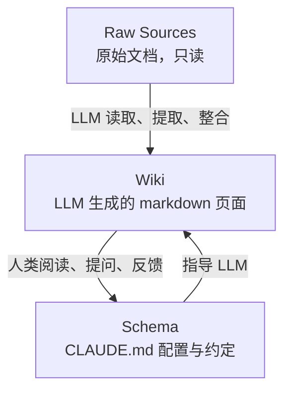

> 来源：Andrej Karpathy 发布的 Gist，提出利用 LLM 增量构建和维护持久化个人知识库（wiki）的模式。本知识库即基于该模式构建。

## 核心主张

传统 LLM 文档交互（如 RAG）的痛点：每次查询都从零检索、拼接碎片，知识无法积累。Karpathy 提出的替代方案是——让 LLM **增量编译并维护一个持久化的 wiki**，而非仅在查询时检索原始文档。

关键差异：**wiki 是持久且复利增长的产物**。交叉引用已建立、矛盾已标注、综合结论已反映所有已读材料。

## 三层架构

- **Raw Sources**：人类筛选的源文档，不可变，是真相来源
- **Wiki**：LLM 全权负责创建、更新、交叉引用和一致性维护
- **Schema**：配置文档（如 CLAUDE.md），定义目录结构、命名约定、操作流程

## 五大操作

1. **Ingest**：添加新源 → LLM 读取 → 写摘要 → 更新实体/概念页 → 更新索引 → 记录日志。单个源通常触及 10–15 个 wiki 页面
2. **Query**：对 wiki 提问 → LLM 读取相关页面 → 综合回答并标注引用。优质回答可回写为 wiki 新页面，使探索也产生复利
3. **Lint**：健康检查——矛盾、过时声明、孤儿页、缺失交叉引用、数据缺口

## 关键文件

- **index.md**：内容导向的目录，按分类列出所有页面，每次 ingest 后更新
- **log.md**：时间线记录，append-only，追踪 wiki 演变历程

## 为什么有效

维护知识库的枯燥部分（更新交叉引用、保持摘要时效、标注矛盾、维护一致性）正是 LLM 擅长而人类易放弃的工作。人类负责：筛选源、引导分析、提出好问题、思考意义。LLM 负责：其他一切。

## 思想渊源

与 Vannevar Bush 1945 年提出的 **Memex** 精神相通——私人的、主动策展的、文档间关联与文档本身同等有价值的知识库。Bush 未解决的是「谁来维护」，LLM 补上了这一环。

## 适用场景

- 个人目标追踪、健康、心理学、自我提升
- 数周至数月的研究深潜（论文、文章、报告）
- 读书伴侣（逐章归档，构建角色、主题、情节线索的互联网络）
- 企业/团队内部 wiki（由 Slack、会议纪要、项目文档喂养）
- 竞争分析、尽职调查、旅行规划、课程笔记、爱好深潜
